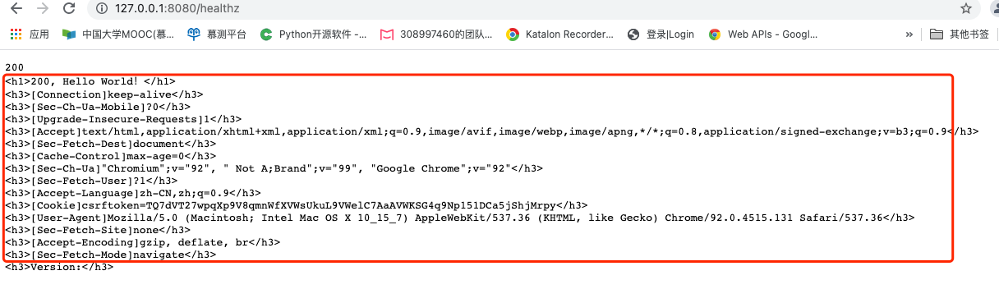
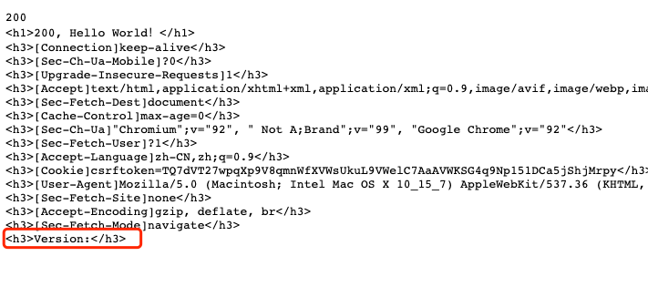
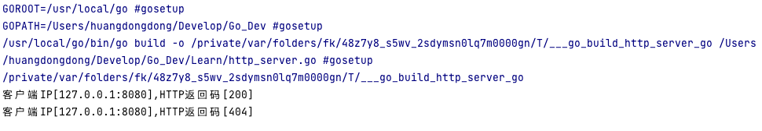

# 作业
编写一个 HTTP 服务器，大家视个人不同情况决定完成到哪个环节，但尽量把 1 都做完。

* 接收客户端 request，并将 request 中带的 header 写入 response header
* 读取当前系统的环境变量中的 VERSION 配置，并写入 response header
* Server 端记录访问日志包括客户端 IP，HTTP 返回码，输出到 server 端的标准输出
当访问 localhost/healthz 时，应返回 200
  
# 执行结果
## 1.将request的中的header写入response header
### 代码说明
```go
    for k, value := range r.Header {
    	tmp := "<h3>[" + k + "]" + strings.Join(value, " ")+ "</h3>"
    	content = append(content, tmp)
    }
```
### 效果如下


## 2.读取当前系统的环境变量中的 VERSION 配置，并写入 response header
### 代码说明
```go
    version := os.Getenv("VERSION")
    version = "<h3>Version:" + version + "</h3>"
    content = append(content, version)
```
### 效果如下


## 3.Server 端记录访问日志包括客户端 IP，HTTP 返回码，输出到 server 端的标准输出
### 效果如下

