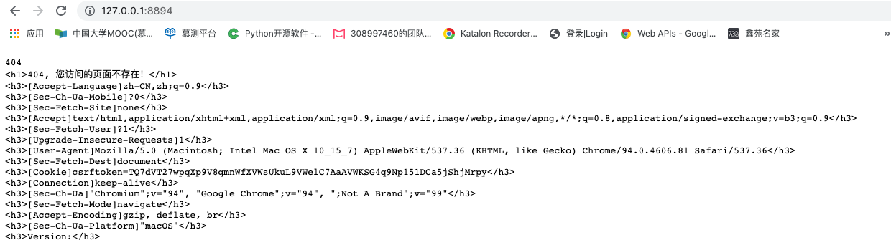
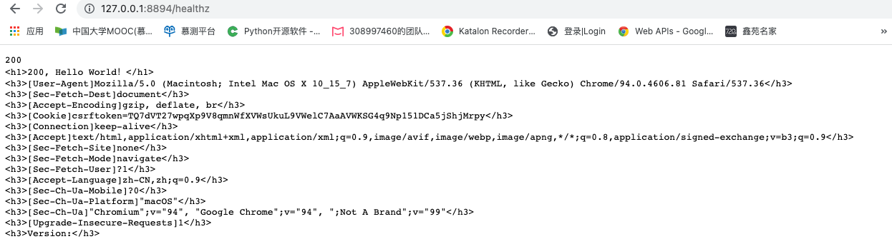

# 作业

* 构建本地镜像。
* 编写 Dockerfile 将练习 2.2 编写的 httpserver 容器化（请思考有哪些最佳实践可以引入到 Dockerfile 中来）。
* 将镜像推送至 Docker 官方镜像仓库。
* 通过 Docker 命令本地启动 httpserver。
* 通过 nsenter 进入容器查看 IP 配置。
* 作业需编写并提交 Dockerfile 及源代码。

  
# Dockerfile
```dockerfile
# 构建：使用golang 制定版本
FROM golang:alpine as build

# 容器环境变量添加
ENV GO111MODULE=auto
ENV GOPROXY=https://goproxy.cn,direct

# 设置当前工作区
WORKDIR /go/src
# 把全部文件添加到/go/release目录
ADD http_server.go /go/src
# 编译: http_server.go编译为可执行的二进制文件
RUN cd /go/src && go build -o http_server

# 运行: 使用 alpine 作为基础镜像
FROM alpine:latest as prod
WORKDIR /app
# 在build阶段, 复制时区配置到镜像的
COPY --from=build /go/src/http_server /app/
# 设置端口
EXPOSE 8080
CMD ["/app/http_server"]
```

## 1.通过 Dockerfile 构建容器镜像
```shell
huangdongdongdeMacBook-Pro:http_server huangdongdong$ docker images
REPOSITORY                 TAG       IMAGE ID       CREATED             SIZE
v4                         latest    96d4e7218d70   45 seconds ago      11.7MB
```


## 2.通过 Docker 命令本地启动 httpserver。
### 代码说明
```shell
huangdongdongdeMacBook-Pro:http_server huangdongdong$ docker run -it -p 127.0.0.1:8894:8080  v4:latest
开始进行....
```
### 效果如下,通过127.0.0.1:8894访问




## 3.通过 nsenter 进入容器查看 IP 配置。
### 效果如下

